**TÀI LIỆU ĐẶC TẢ YÊU CẦU PHẦN MỀM (SRS) - DỰ ÁN MOJI: HỆ THỐNG CHAT
REAL-TIME**

# **GIỚI THIỆU (INTRODUCTION)**

Tài liệu này cung cấp các đặc tả kỹ thuật chi tiết cho dự án Moji, một
hệ thống trò chuyện thời gian thực (real-time chat). Trong bối cảnh
truyền thông số hiện đại, việc thiết lập các tiêu chuẩn kỹ thuật chặt
chẽ là điều kiện tiên quyết để đảm bảo tính bảo mật dữ liệu và hiệu suất
truyền tải tin nhắn tức thời. Tài liệu đóng vai trò là kim chỉ nam cho
đội ngũ kỹ sư trong việc hiện thực hóa kiến trúc hệ thống ổn định và bảo
mật.

## **Mục đích**

Mục tiêu của tài liệu này là xác định các yêu cầu chức năng và phi chức
năng cho hệ thống Moji, tập trung vào luồng xác thực đa lớp (JWT &
Refresh Token) và cơ chế giao tiếp song công qua Socket.io.

## **Phạm vi**

Hệ thống Moji bao gồm các thành phần:

- **Backend:** Node.js, ExpressJS (RESTful APIs), Socket.io (Realtime
  Communication)

- **Frontend:** ReactJS, Vite, Tailwind CSS + shadcn/ui, Zustand (State
  Management)

- **Database:** MongoDB & MongoDB Atlas

- **Dịch vụ tích hợp:** Cloudinary (lưu trữ phương tiện), Socket.io
  (truyền tin thời gian thực).

## **Định nghĩa và từ viết tắt**

_[JWT (JSON Web Token):]{.underline}_ Mã tiêu chuẩn để truyền tin an
toàn, gồm 3 phần: Header, Payload, Signature.

_[Access Token:]{.underline}_ JWT ngắn hạn (15-30p) dùng để xác thực
quyền truy cập API, lưu tại bộ nhớ ứng dụng (App State).

_[Refresh Token:]{.underline}_ Chuỗi ký tự ngẫu nhiên dài hạn, lưu trong
Database và Cookie HttpOnly, dùng để cấp mới Access Token.

_[Middleware:]{.underline}_ Các hàm trung gian xử lý yêu cầu (xác thực,
kiểm tra quyền) trước khi đến logic chính.

_[Compound Index:]{.underline}_ Chỉ mục kết hợp nhiều trường dữ liệu để
tối ưu hóa hiệu suất truy vấn trong MongoDB.

_[WSS (Web Socket Secure):]{.underline}_ Giao thức truyền dữ liệu hai
chiều bảo mật qua kết nối Socket.

## **Tổng quan**

Tài liệu được chia thành 5 chương chính:

1.  **Giới thiệu:** Tổng quan về dự án và các thuật ngữ.

2.  **Mô tả tổng quan:** Phân tích mô hình hoạt động và các ràng buộc.

3.  **Các yêu cầu cụ thể:** Chi tiết giao diện, chức năng và cấu trúc dữ
    liệu (Entities).

4.  **Các mô hình phân tích:** Sơ đồ tuần tự, trạng thái và luồng dữ
    liệu.\*\*\*\*

# **MÔ TẢ TỔNG QUAN (GENERAL DESCRIPTION)**

## **Góc nhìn sản phẩm**

Moji hoạt động theo mô hình Client-Server. Hệ thống không chỉ đơn thuần
là một ứng dụng nhắn tin mà còn là một nền tảng yêu cầu độ trễ thấp và
tính sẵn sàng cao.

- **Client:** Thực hiện yêu cầu HTTP và duy trì kết nối WSS.

- **Server:** Quản lý phiên làm việc, điều phối tin nhắn qua các
  \"Rooms\" của Socket.io và xử lý lưu trữ đám mây.

## **Chức năng sản phẩm**

1.  **Xác thực:**

- Đăng ký, Đăng nhập (JWT/Refresh Token), Đăng xuất.

2.  **Quản lý bạn bè:**

- Gửi/Chấp nhận/Từ chối lời mời

- Tìm kiếm bạn bè theo _username_

3.  **Hội thoại:**

- Chat 1-1 (Direct Chat) & Chat nhóm (Group Chat)

- Gửi tin nhắn văn bản và tin nhắn kèm hình ảnh.

- Tạo nhóm chat mới và mời bạn bè tham gia.

4.  **Trạng thái thời gian thực:**

- Hiển thị trạng thái Online/Offline của bạn bè

- Theo dõi trạng thái tin nhắn: Đã gửi (Sent) / Đã xem (Seen).

- Hiển thị số lượng tin nhắn chưa đọc (unreadCount).

5.  **Giao diện & Hồ sơ cá nhân:**

- Tự động tải tin nhắn cũ khi cuộn lên (Infinite Scroll).

- Đổi chủ đề giao diện (Dark / Light Theme) và hỗ trợ hoàn toàn
  Responsive.

- Cập nhật thông tin cá nhân và Upload Avatar trực tiếp qua Cloudinary.

# **CÁC YÊU CẦU CỤ THỂ (SPECIFIC REQUIREMENTS)**

## **Yêu cầu giao diện bên ngoài**

### **Giao diện người dùng (UI)**

> Layout chính chia làm 2 phần: Sidebar bên trái và Chat Window bên
> phải.
>
> Sidebar gồm 3 phần: Header (Chuyển Theme sáng/tối), Content (Nút nhắn
> tin mới, Danh sách Nhóm, Danh sách Bạn bè), Footer (Thông báo lời mời
> kết bạn, Profile).
>
> Chat Window gồm: Header (Thông tin nhóm/người chat), Body (Danh sách
> tin nhắn render theo bên gửi/bên nhận), Input Bar (Thanh nhập tin
> nhắn, Emoji, đính kèm ảnh, nút gửi).

### **Giao diện phần mềm**

> Cloudinary SDK: Sử dụng để tải ảnh với transformation: limit 200x200,
> crop: fill để tối ưu hóa hiển thị avatar.
>
> Swagger UI: Cung cấp tài liệu API tương tác tại /api-docs.
>
> MongoDB Atlas: Lưu trữ dữ liệu đám mây.

### **Giao diện truyền thông**

> Giao thức HTTP/HTTPS cho REST APIs.
>
> Giao thức WebSocket (WSS) thông qua Socket.io Client / Server.

## **Yêu cầu chức năng**

### **Hệ thống xác thực (Auth)**

> **Đăng ký (Sign Up)**
>
> Backend truy vấn kiểm tra tính duy nhất của username trong MongoDB
> trước khi tạo.
>
> Bắt buộc mã hóa mật khẩu bằng thuật toán bcrypt trước khi lưu vào cơ
> sở dữ liệu.
>
> Trả về phản hồi JSON chuẩn hóa (Success/Error status) giúp Frontend
> hiển thị thông báo toast lập tức mà không reload trang.
>
> **Đăng nhập / Cấp phát Token (Sign In)**
>
> Xác thực thông tin người dùng qua bcrypt.compare.
>
> Tách biệt 2 cơ chế Token:

- Access Token: Hạn ngắn (15-30 phút), lưu hoàn toàn ở bộ nhớ ngầm của
  Client (Zustand State) để truy cập API nhanh chóng.

- Refresh Token: Hạn dài, lưu trong HTTP-Only Cookie (kèm cờ SameSite và
  Secure) để chống tấn công XSS/CSRF tuyệt đối.

### **Quản lý bạn bè (Friends)**

> **Tìm kiếm / Gửi yêu cầu kết bạn (Friend Request)**
>
> Bắt buộc kiểm tra ràng buộc điều kiện ở Backend: Không gửi kết bạn cho
> chính mình, không gửi trùng lặp nếu đã là bạn bè hoặc đang có lời mời
> chờ xử lý.
>
> Ngay khi tạo bản ghi FriendRequest, Server phát sự kiện Socket.io đến
> người nhận để cập nhật thông báo/badge đỏ trên UI theo thời gian thực.
>
> **Phê duyệt / Từ chối kết bạn (Accept / Reject Friend Request)**
>
> Khi chấp nhận: Backend lưu dữ liệu hai chiều vào collection Friends,
> xoá bản ghi FriendRequest.
>
> Khởi tạo sẵn một cuộc trò chuyện 1-1 (Conversation) giữa 2 người dùng.
>
> Bắn sự kiện Socket real-time giúp danh sách Bạn bè và Cuộc trò chuyện
> của cả 2 tài khoản tự cập nhật tức thì.
>
> **Theo dõi trạng thái Online / Offline (Real-time Presence Tracking)**
>
> Socket Server duy trì một map bộ nhớ ngầm userSocketMap = { userId:
> socketId }.
>
> Khi bất kỳ người dùng nào kết nối (connection) hoặc ngắt kết nối
> (disconnect), Server ngay lập tức phát sự kiện Broadcast
> getOnlineUsers chứa danh sách các userId đang online đến toàn bộ
> Client.
>
> Frontend cập nhật danh sách vào Zustand Store để giao diện tự cập nhật
> trạng thái mà không sử dụng cơ chế Polling (gọi API liên tục), giúp
> tiết kiệm băng thông tối đa.

### **Hệ thống tin nhắn (Messaging)**

> **Gửi / Nhận tin nhắn**
>
> Xử lý Upload ảnh: Ảnh gửi đi được xử lý ngầm qua Middleware Multer và
> upload trực tiếp lên Cloudinary để lấy secure_url, không lưu file tĩnh
> ở Server local giúp Server không bị quá tải đĩa cứng.
>
> Lưu trữ & Cập nhật: Backend tạo bản ghi Message mới, đồng thời cập
> nhật trường lastMessage và thời gian updatedAt của cuộc trò chuyện
> tương ứng.
>
> Socket Emission: Server gửi sự kiện newMessage đến đúng conversationId
> (Socket Room).
>
> Sắp xếp mượt mà trên UI: Nhờ thuộc tính updatedAt vừa cập nhật, cuộc
> trò chuyện có tin nhắn mới tự động nhảy lên vị trí trên cùng của danh
> sách chat mà người dùng không cần reload trang.
>
> **Lịch sử tin nhắn / Tải thêm tin nhắn cũ**
>
> Áp dụng Phân trang dữ liệu (Pagination) phía Backend, chỉ trả về một
> số lượng tin nhắn nhất định cho mỗi đợt truy vấn nhằm tối ưu tốc độ
> render DOM.
>
> Phía Frontend triển khai Infinite Scroll: Khi người dùng cuộn tới vị
> trí trên cùng của khung chat, hệ thống tự động kích hoạt API lấy trang
> tin nhắn tiếp theo và nối (prepend) vào danh sách.
>
> Giữ nguyên vị trí thanh cuộn tương đối để màn hình không bị giật hay
> nảy vị trí khi dữ liệu tin nhắn cũ load xong.
>
> **Quản lý / Cập nhật trạng thái "Đã xem"**
>
> Hai trường hợp tự động kích hoạt API markAsSeen:

1.  Người dùng nhấp chọn mở một hộp thoại chat.

2.  Người dùng đang mở sẵn hộp thoại chat đó và có tin nhắn mới gửi đến
    (coi như người dùng đã đọc tin nhắn tức thì).

> Xử lý Backend: Thêm userId vào mảng seenBy của Conversation, đưa
> unreadCount của người đó về 0, đồng thời bắn sự kiện Socket
> readMessage.
>
> Đồng bộ UI: Frontend nhận phản hồi và xóa Badge thông báo tin chưa
> đọc, cập nhật trạng thái \"Đã xem\" tức thì trên màn hình đối phương.
>
> **Tạo nhóm trò chuyện**
>
> Đặt cờ isGroup: true, đính kèm danh sách ID mảng participants.
>
> Phát sự kiện Socket thông báo đến tất cả thành viên trong danh sách để
> nhóm chat lập tức xuất hiện trên màn hình của họ.

### **Chức năng Giao diện & Trải nghiệm Người dung**

> **Tự động cuộn xuống tin nhắn mới nhất**
>
> Sử dụng React.useRef gắn ở phần tử cuối cùng của khung chat kết hợp
> hàm scrollIntoView({ behavior: \'smooth\' }).
>
> Tạo chuyển động cuộn mượt mà giúp người dùng không bị mất định hướng
> thị giác.
>
> **Tùy chỉnh giao diện Sáng / Tối**
>
> Trạng thái Theme được quản lý trong Zustand Store và lưu giữ vào
> localStorage.
>
> Đảm bảo khi refresh trình duyệt hay chuyển trang, theme không bị nhấp
> nháy (flicker) về trạng thái mặc định.
>
> **Giao diện tương thích đa thiết bị**
>
> Xây dựng bằng Tailwind CSS kết hợp các Shadcn UI Components.
>
> Trên thiết bị di động, hệ thống tự động ẩn Sidebar danh sách chat khi
> người dùng bấm vào một cuộc trò chuyện cụ thể và cung cấp nút Back
> tiện lợi

## **Non-Functional Requirements**

> **Performance Requirements**
>
> _[Thời gian phản hồi tin nhắn:]{.underline}_ Tin nhắn thời gian thực
> qua Socket.io phải được truyền đến thiết bị người nhận trong thời gian
> dưới 100ms ở điều kiện mạng tiêu chuẩn.
>
> _[Tốc độ tải dữ liệu (Page Load & API):]{.underline}_

- API lấy danh sách hội thoại/tin nhắn phản hồi dưới 300ms

- Nếu thời gian phản hồi quá 300ms, giao diện phía React phải lập tức
  hiển thị Skeleton UI để tránh cảm giác đơ/treo màn hình.

> _[Tối ưu truy vấn (Database Optimization):]{.underline}_ Sử dụng cơ
> chế Compound Indexing trong MongoDB giúp thời gian tìm kiếm đạt độ
> phức tạp O(log n) ngay cả khi bộ dữ liệu tăng cao
>
> **Security Requirements**
>
> _[Mã hóa mật khẩu:]{.underline}_ Mật khẩu người dùng không được lưu
> dưới dạng văn bản thuần (plain text) mà phải mã hóa một chiều bằng
> thuật toán BCrypt với ít nhất 10 salt rounds.
>
> _[Bảo vệ Token (XSS & CSRF Prevention):]{.underline}_

- Access Token ngắn hạn lưu ở bộ nhớ ứng dụng ngầm (Zustand State),
  không lưu tại localStorage để chống tấn công XSS.

- Refresh Token phải lưu trong HTTP-Only Cookie kết hợp với thuộc tính
  SameSite và Secure để chống tấn công CSRF

> _[Mã hóa đường truyền:]{.underline}_ 100% kết nối REST API phải sử
> dụng giao thức HTTPS, toàn bộ kết nối thời gian thực phải qua giao
> thức WSS (WebSocket Secure).
>
> _[Xác thực đường dẫn (Protected Routes):]{.underline}_ Tất cả API
> nghiệp vụ (trừ /sign-in, /sign-up) phải đi qua Middleware xác thực JWT
>
> **Availability & Reliability**
>
> _[Thời gian hoạt động (Uptime):]{.underline}_ Hệ thống đạt chỉ số sẵn
> sàng khi vận hành trên nền tảng đám mây (Render/Vercel)
>
> _[Tự động kết nối lại (Auto Reconnection):]{.underline}_ Nếu client
> mất mạng đột ngột hoặc Socket.io bị ngắt kết nối, Socket client phía
> React phải có cơ chế tự động thử kết nối lại ngầm (auto-reconnect)
> ngay khi có mạng trở lại.
>
> _[Tự động khôi phục phiên (Retry mechanism):]{.underline}_ Axios
> Interceptor có cơ chế tự động gọi API gia hạn token và gửi lại request
> bị lỗi tối đa 4 lần trước khi quyết định ngắt phiên làm việc.
>
> **Scalability & Maintainability**
>
> _[Kiến trúc mã nguồn:]{.underline}_ Backend thiết kế theo mô hình phân
> tầng rõ ràng (Routes - Middlewares - Controllers - Models).
>
> _[Tài liệu API (Self-Documenting):]{.underline}_ Toàn bộ các API phải
> được mô tả đầy đủ tham số, request body, response mẫu thông qua công
> cụ Swagger UI tại đường dẫn /api-docs để lập trình viên khác dễ dàng
> tiếp cận
>
> _[Quản lý biến môi trường:]{.underline}_ Mọi tham số nhạy cảm (JWT
> Secret, Database URI, Cloudinary Keys) phải lưu tách biệt trong file
> .env.
>
> **Usability & Compatibility**
>
> _[Tương thích trình duyệt (Browser Compatibility):]{.underline}_ Ứng
> dụng React/Vite phải chạy mượt mà trên tất cả trình duyệt hiện đại
> (Chrome, Edge, Firefox, Safari).
>
> _[Tương thích màn hình (Responsive & Dark Mode):]{.underline}_ Giao
> diện thiết kế bằng Tailwind CSS phải tương thích với mọi kích thước
> màn hình (Desktop, Tablet, Mobile)

# **CÁC MÔ HÌNH PHÂN TÍCH (ANALYSIS MODELS)**

## **Use Cases**

### **Xác thực / Quản lý Tài khoản**

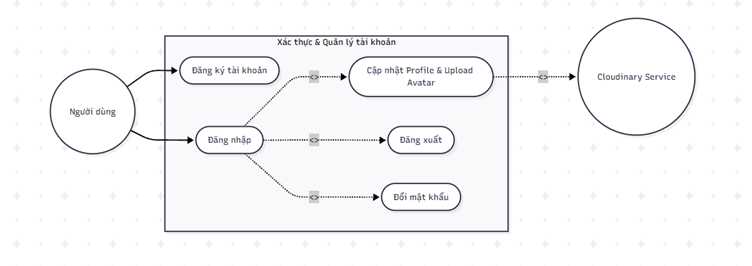{width="6.270138888888889in"
height="2.21875in"}

### **Quản lý bạn bè & Trạng thái**

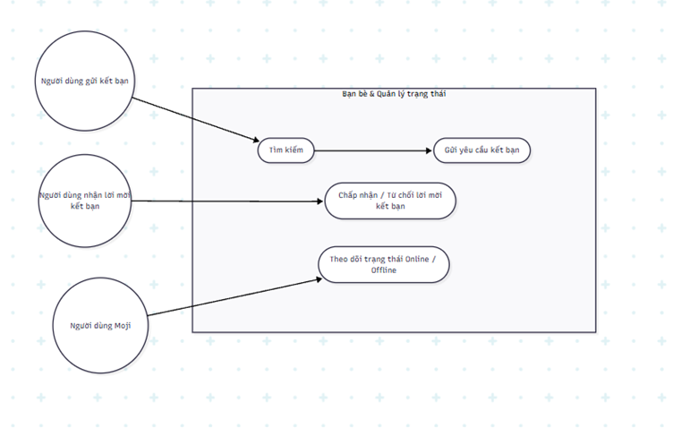{width="6.270138888888889in"
height="3.984027777777778in"}

### **Trò chuyện / Hội thoại**

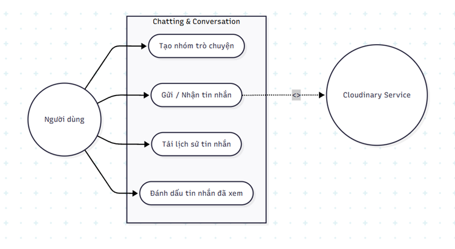{width="6.270138888888889in"
height="3.4368055555555554in"}

## **Sơ đồ tuần tự (Sequence Diagrams)**

### **Đăng nhập / Khởi tạo phiên**

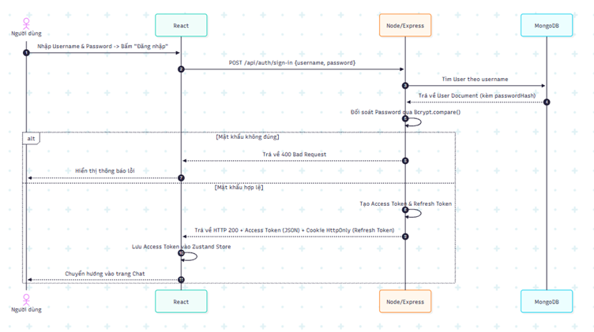{width="6.270138888888889in"
height="3.5069444444444446in"}

### **Tự động gia hạn Access Token**

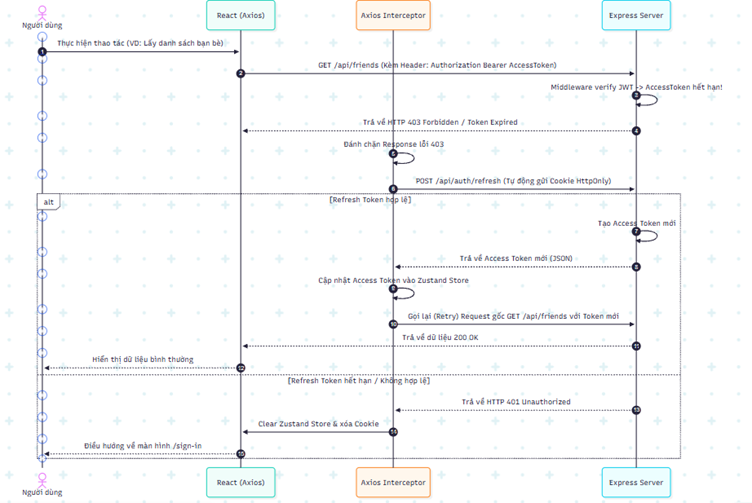{width="6.270138888888889in"
height="4.195833333333334in"}

### **Gửi / Nhận tin nhắn**

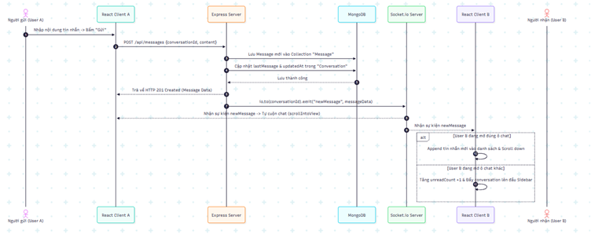{width="6.270138888888889in"
height="2.527083333333333in"}

### **Tải ảnh phương tiện đính kèm**

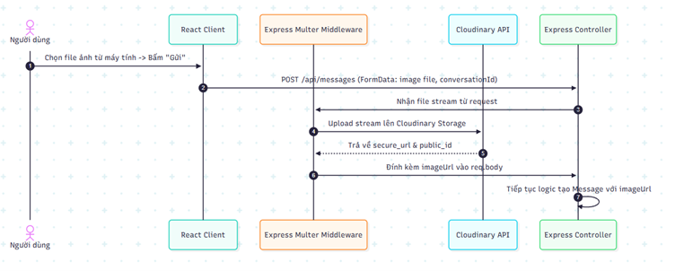{width="6.270138888888889in"
height="2.517361111111111in"}

### **Chấp nhận kết bạn / Khởi tạo Hội thoại**

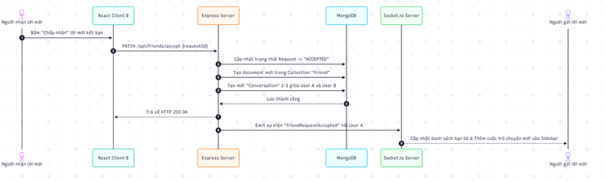{width="6.270138888888889in"
height="1.8715277777777777in"}

### **Đánh dấu đã xem tin nhắn**

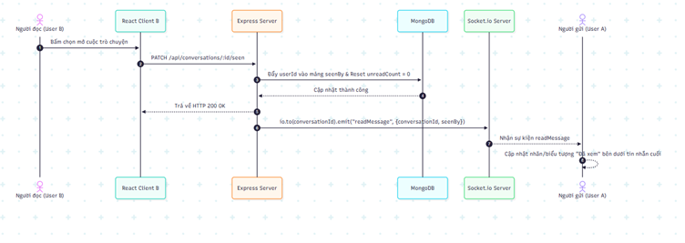{width="6.270138888888889in"
height="2.222916666666667in"}

## **Sơ đồ chuyển trạng thái (STD)**

### **Lời mời kết bạn**

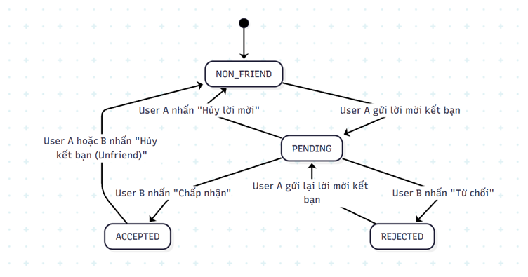{width="6.270138888888889in"
height="3.2930555555555556in"}

### **Phiên làm việc (Trạng thái On/Off)**

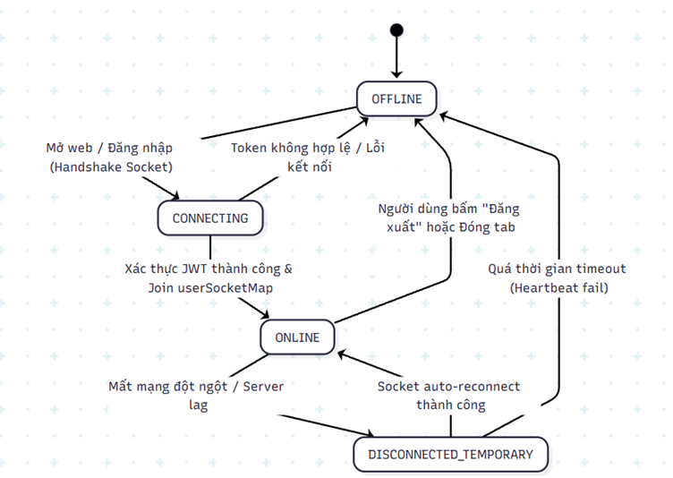{width="6.270138888888889in"
height="4.450694444444444in"}

### **Trạng thái "Đã xem"/"Chưa đọc" của tin nhắn**

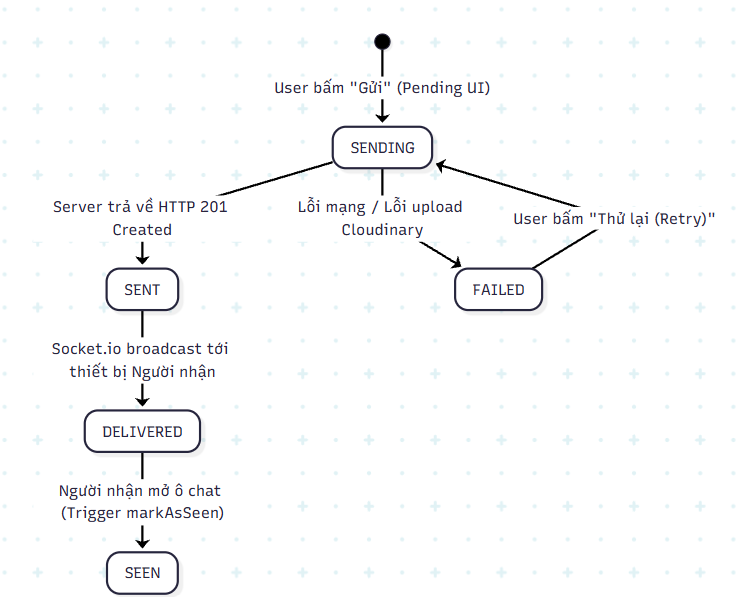{width="6.167201443569554in"
height="4.975430883639545in"}

# **PHỤ LỤC (APPENDICES)**

## **Danh mục API (Swagger)**

- POST /api/auth/sign-in: Đăng nhập.

- POST /api/auth/refresh-token: Cấp mới Access Token.

- GET /api/conversations: Lấy danh sách chat (Sắp xếp theo
  lastMessageAt).

- GET /api/messages/:convoId: Lấy tin nhắn (Cursor-based).

## **Cấu hình Môi trường (.env)**

- ACCESS_TOKEN_SECRET: Khóa ký JWT.

- MONGODB_URI: Kết nối Atlas.

- CLOUDINARY_URL: Cấu hình lưu trữ ảnh.
